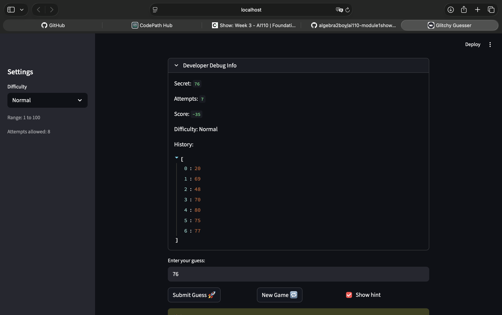

# 🎮 Game Glitch Investigator: The Impossible Guesser

## 🚨 The Situation

You asked an AI to build a simple "Number Guessing Game" using Streamlit.
It wrote the code, ran away, and now the game is unplayable. 

- You can't win.
- The hints lie to you.
- The secret number seems to have commitment issues.

## 🛠️ Setup

1. Install dependencies: `pip install -r requirements.txt`
2. Run the broken app: `python -m streamlit run app.py`

## 🕵️‍♂️ Your Mission

1. **Play the game.** Open the "Developer Debug Info" tab in the app to see the secret number. Try to win.
2. **Find the State Bug.** Why does the secret number change every time you click "Submit"? Ask ChatGPT: *"How do I keep a variable from resetting in Streamlit when I click a button?"*
3. **Fix the Logic.** The hints ("Higher/Lower") are wrong. Fix them.
4. **Refactor & Test.** - Move the logic into `logic_utils.py`.
   - Run `pytest` in your terminal.
   - Keep fixing until all tests pass!

## 📝 Document Your Experience

**Game purpose:** A number-guessing game where the player picks a difficulty, receives a range, and tries to guess the secret number within a limited number of attempts. Hints guide you higher or lower after each wrong guess.

**Bugs found:**
1. **Inverted hints** — "Too High" said "Go HIGHER!" and "Too Low" said "Go LOWER!" (exact opposite of correct).
2. **String comparison on even attempts** — the secret was cast to `str` every other guess, making Python use lexicographic ordering (`"9" > "50"` is `True`), producing wrong hints.
3. **Attempts initialised at 1** — the counter started at 1 so the first guess appeared as attempt 2 and "Attempts left" was always off by one.
4. **Hardcoded range message** — the info banner always said "1 to 100" regardless of difficulty.
5. **Hard difficulty easier than Normal** — Hard used range 1–50 (smaller = easier), fixed to 1–200.
6. **`logic_utils.py` raised `NotImplementedError`** — all four functions were stubs; tests couldn't run.

**Fixes applied:**
- Implemented all four functions in `logic_utils.py` with corrected logic.
- Updated `app.py` to import from `logic_utils` and removed the buggy local definitions.
- Fixed attempts initialisation (`0` instead of `1`).
- Fixed the info message to use `{low}` and `{high}` variables.
- Removed the even-attempt string-cast block; always pass integer secret to `check_guess`.
- Updated and expanded `tests/test_game_logic.py` with 7 additional targeted tests.

## 📸 Demo

## 🚀 Stretch Features

- [ ] [If you choose to complete Challenge 4, insert a screenshot of your Enhanced Game UI here]
